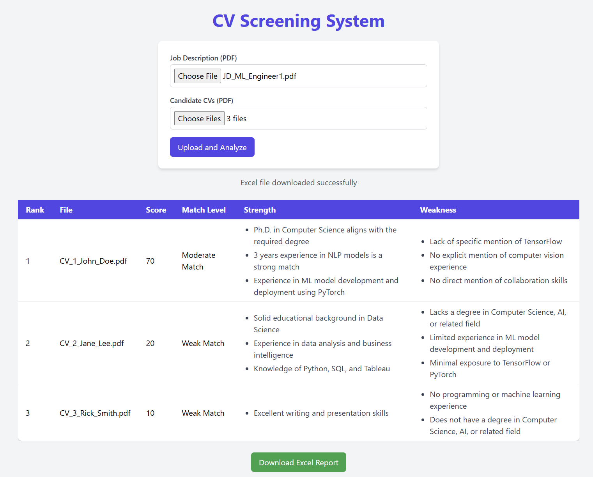

# ChatRecruit

A modern AI-powered CV screening and analysis tool that helps recruiters match candidates with job descriptions.

## Features

- **Intelligent CV Analysis**: Uses AI to analyze and compare CVs against job descriptions
- **Score-Based Ranking**: Automatically ranks candidates with scores from 0-100
- **Match Level Classification**: Categorizes candidates as Strong, Moderate, or Weak matches
- **Strength & Weakness Analysis**: Identifies key strengths and weaknesses for each candidate
- **Excel Report Export**: Generate downloadable Excel reports of analysis results

## Frontend Overview



## Tech Stack

- **Backend**: FastAPI (Python)
- **Frontend**: HTML/CSS/JavaScript with Tailwind CSS
- **AI**: OpenAI GPT-3.5 Turbo
- **Document Processing**: PyMuPDF for PDF text extraction
- **Reporting**: Openpyxl for Excel file generation

## Getting Started

### Prerequisites

- Python 3.7+
- OpenAI API key

### Installation

1. Clone the repository:
   ```bash
   git clone https://github.com/yourusername/ChatRecruit.git
   cd ChatRecruit
   ```

2. Install required packages:
   ```bash
   pip install -r requirements.txt
   ```

3. Set up your OpenAI API key:
   - Create a .env file in the project root
   - Add your API key: `OPENAI_API_KEY=your_api_key_here`

### Running the Application

Start the FastAPI server:
```bash
uvicorn main:app --reload --host 0.0.0.0 --port 8000
```

Visit `http://localhost:8000/main` in your browser to access the application.

## Usage

1. **Upload Job Description**: Select a PDF file containing the job description
2. **Upload Candidate CVs**: Select multiple PDF files containing candidate resumes
3. **Analyze**: Click "Upload and Analyze" to process the files
4. **Review Results**: View the table of ranked candidates with scores and analysis
5. **Export**: Click "Download Excel Report" to export the results as an Excel file

## Project Structure

```
ChatRecruit/
├── main.py              # FastAPI application and endpoints
├── extract_text.py      # PDF text extraction utilities
├── main/                # Static frontend files
│   ├── index.html       # Main application page
│   ├── script.js        # Frontend JavaScript
│   └── style.css        # Additional CSS styles
├── uploads/             # Temporary storage for uploaded files
└── requirements.txt     # Python dependencies
```

## How It Works

1. The application extracts text from uploaded PDF files
2. Job descriptions and CVs are sent to the OpenAI API for analysis
3. The AI evaluates each CV against the job description, providing:
   - A match score (0-100)
   - Match level classification
   - Strengths and weaknesses
4. Results are ranked and displayed in a table
5. Users can download a formatted Excel report of the analysis

## Contributing

Contributions are welcome! Please feel free to submit a Pull Request.

## Future works
- **Integration with ATS**: Enable seamless integration with Applicant Tracking Systems for better workflow management.
- **Multi-language Support**: Add support for analyzing CVs and job descriptions in multiple languages.
- **Customizable Scoring Criteria**: Allow users to define their own scoring parameters and weights.
- **Real-time Collaboration**: Introduce features for team collaboration and shared analysis.
- **Mobile Application**: Develop a mobile app for on-the-go access and analysis.
- **Enhanced Reporting**: Provide additional report formats and visualizations for better insights.
- **Data Security Enhancements**: Implement advanced encryption and compliance with GDPR and other data protection regulations.
- **AI Model Fine-tuning**: Continuously improve the AI model with user feedback and domain-specific training.

## License

This project is licensed under the MIT License - see the LICENSE file for details.

## Acknowledgments

- OpenAI for providing the GPT API
- FastAPI for the efficient web framework
- PyMuPDF for PDF processing capabilities